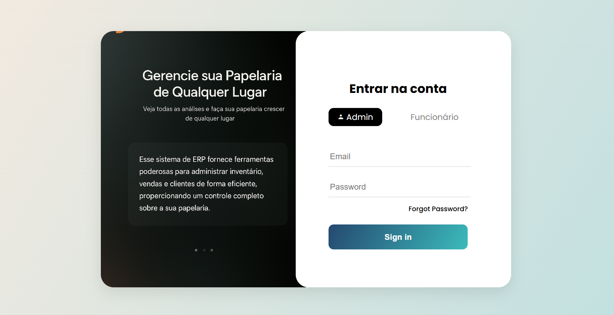
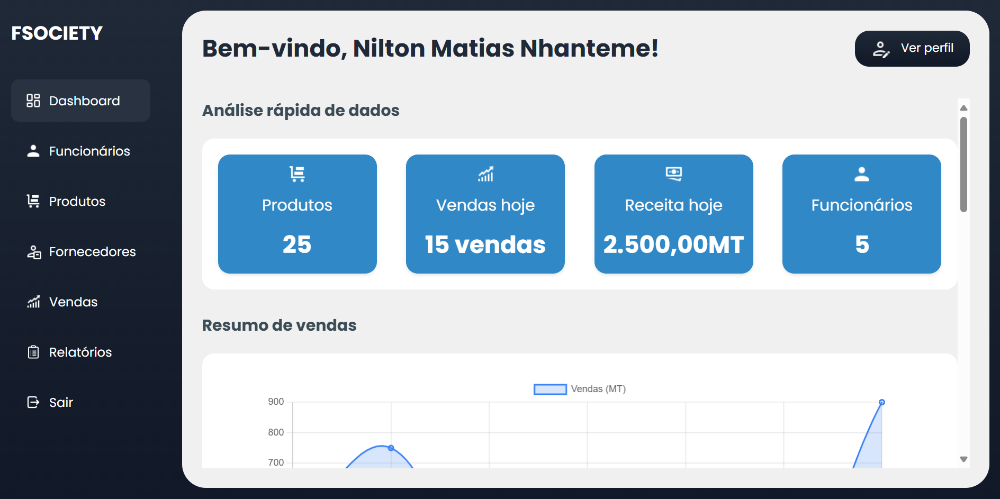
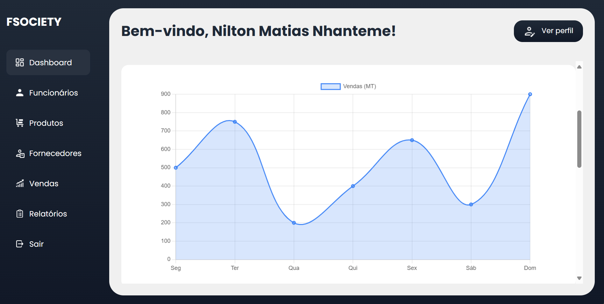
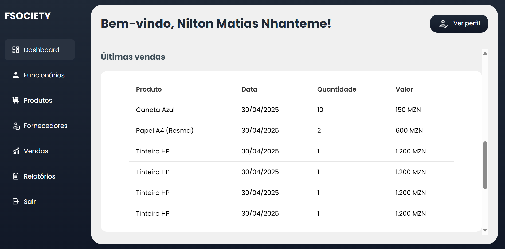
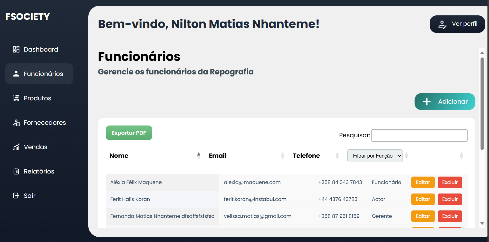
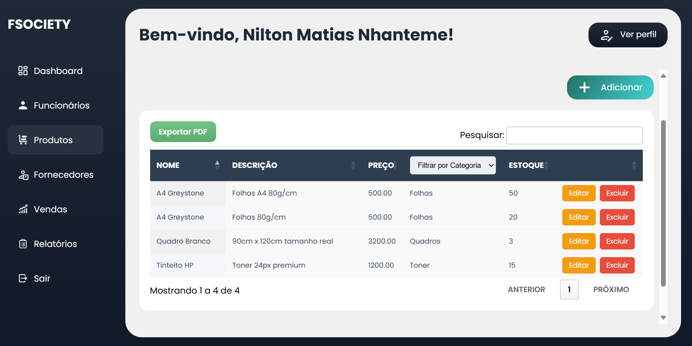

# Mini-ERP-Papelaria

<p align="center">
  
</p>

## Sobre o Projeto

O **Mini-ERP-Papelaria** é um sistema de gestão empresarial (ERP) desenvolvido para atender às necessidades de papelarias e pequenas empresas que buscam organizar e controlar suas operações de maneira eficiente. Ele fornece funcionalidades para gerenciar produtos, fornecedores, funcionários, e muito mais.

Este projeto foi construído utilizando o framework **Laravel**, garantindo uma arquitetura robusta e escalável.

---

## Funcionalidades

- **Gestão de Produtos**: Cadastro, edição, exclusão e listagem de produtos.
- **Gestão de Fornecedores**: Gerencie seus fornecedores diretamente no sistema.
- **Gestão de Funcionários**: Controle informações e permissões de funcionários.
- **Dashboard**: Visualize métricas importantes do negócio em tempo real.
- **Design Responsivo**: Interface adaptável para dispositivos móveis e desktops.

---

## Imagens do Projeto

### Imagem 1: Tela Inicial


### Imagem 2: Dashboard


### Imagem 3: Dashboard Gráfico


### Imagem 4: Dashboard tabela


### Imagem 5: Página de Funcionários


### Imagem 6: Produtos


---

## Tecnologias Utilizadas

- **Backend**: [PHP](https://www.php.net/) com [Laravel](https://laravel.com/)
- **Frontend**: [Blade Templates](https://laravel.com/docs/blade), [CSS](https://developer.mozilla.org/pt-BR/docs/Web/CSS), e [JavaScript](https://developer.mozilla.org/pt-BR/docs/Web/JavaScript)
- **Banco de Dados**: MySQL
- **Outros**: Docker (opcional para ambiente de desenvolvimento)

---

## Instalação e Configuração

### Pré-requisitos

Certifique-se de ter os seguintes softwares instalados:
- [PHP 8.x](https://www.php.net/)
- [Composer](https://getcomposer.org/)
- [Node.js](https://nodejs.org/)
- [MySQL](https://www.mysql.com/)
- Opcional: [Docker](https://www.docker.com/)

### Passos para Instalação

1. **Clone o Repositório**
   ```bash
   git clone https://github.com/NillasIT/Mini-ERP-Papelaria.git
   cd Mini-ERP-Papelaria
   ```

2. **Instale as Dependências PHP**
   ```bash
   composer install
   ```

3. **Instale as Dependências Frontend**
   ```bash
   npm install && npm run dev
   ```

4. **Configure o Arquivo `.env`**
   - Copie o arquivo `.env.example` para `.env`:
     ```bash
     cp .env.example .env
     ```
   - Configure as variáveis de ambiente, como conexão com o banco de dados.

5. **Gere a Chave da Aplicação**
   ```bash
   php artisan key:generate
   ```

6. **Execute as Migrações**
   ```bash
   php artisan migrate
   ```

7. **Inicie o Servidor**
   ```bash
   php artisan serve
   ```

Acesse o sistema pelo navegador em [http://localhost:8000](http://localhost:8000).

---

## Contribuição

Contribuições são bem-vindas! Siga os passos abaixo para contribuir:

1. Faça um fork do repositório.
2. Crie uma branch para sua feature/bugfix:
   ```bash
   git checkout -b minha-feature
   ```
3. Faça o commit das suas alterações:
   ```bash
   git commit -m "Descrição das alterações"
   ```
4. Envie sua branch para o repositório remoto:
   ```bash
   git push origin minha-feature
   ```
5. Abra um Pull Request.

---

## Licença

Este projeto é licenciado sob a licença [MIT](https://opensource.org/licenses/MIT). Sinta-se à vontade para usar e modificar o código conforme necessário.

---

## Contato

Se você tiver dúvidas ou sugestões, entre em contato:

- **Autor:** [NillasIT](https://github.com/NillasIT)
- **E-mail:** nillas.tech@gmail.com